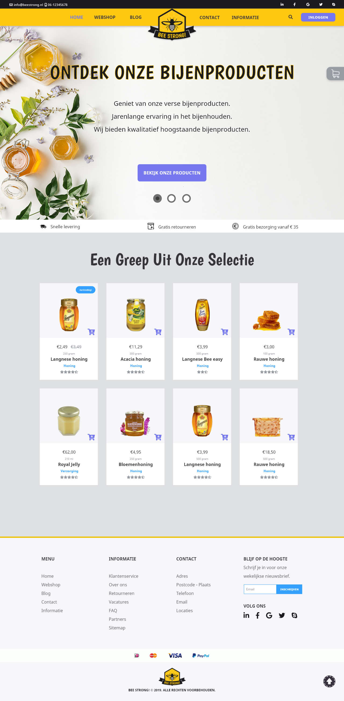
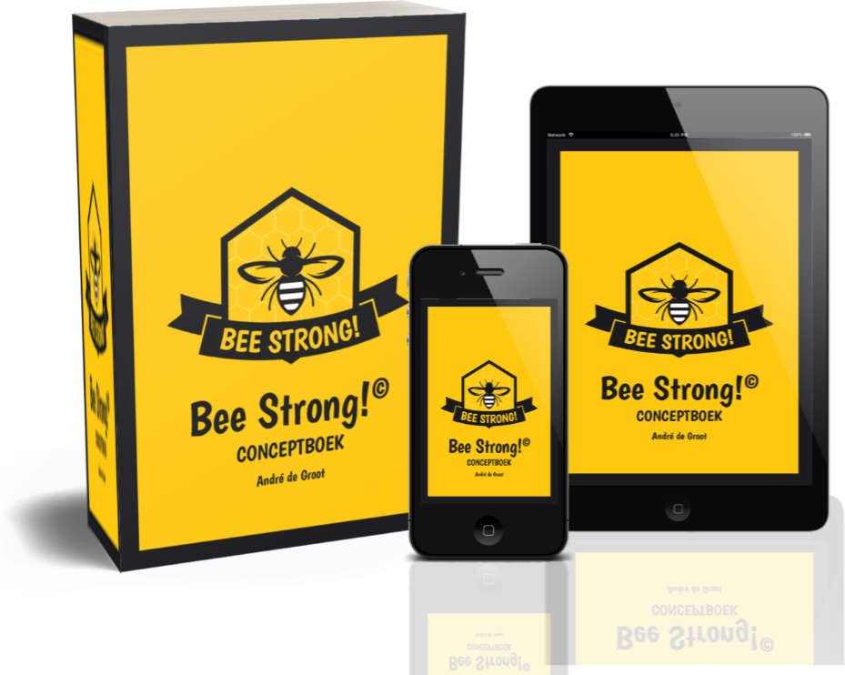
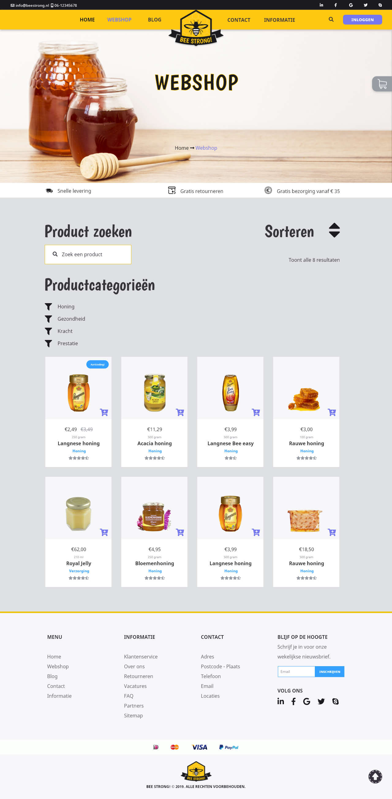

# College of Multimedia Opdracht MM-A-1

__Opdrachtomschrijving__

MM-A deel 1: Maak een conceptboek voor jouw website.

De MM-A opdracht bestaat uit twee delen:
* Deel I omvat de planning en het realiseren van een conceptboek voor de website.
* Deel 2 omvat de productie van de website.

Je bent vrij om zelf een onderwerp te kiezen. Je kunt bijvoorbeeld een website maken voor een museum, de kruidenier op de hoek of over jezelf. 

Misschien ken je iemand die een nieuwe website wilt hebben?

## Concept Art & Prototypes

__Homepage prototype__

__Logo__

__Products__

__Webshop prototype__

## Concept boek
[Download en bekijk het Conceptboek Bee Strong! Webshop](./conceptbook-v134-printerette-reduced.pdf)

